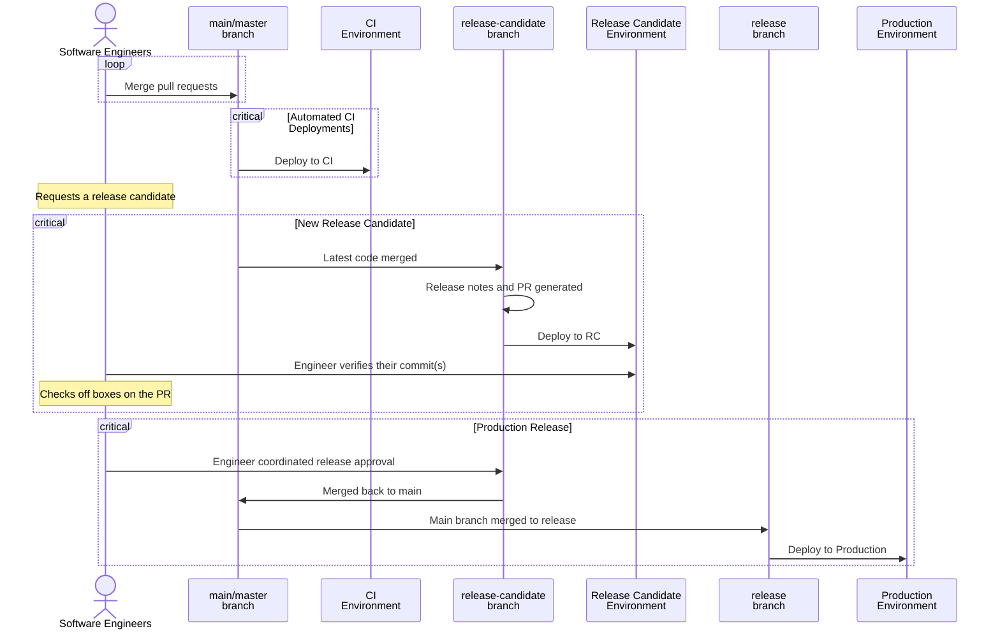

# Web Application Release Process

## Responsibilities

### Individual Engineer

As an engineer you have responsibilities to ensure the work you've done is reliably released into production:

- Before your code is merged:
  - Coordinate with DevOps on having configuration in place both on RC and production for your changes _before_ it gets merged so that releases are not held up.
- After your code is merged:
  - When the changes have been deployed on RC, verify your changes via functional testing and obtain acceptance from any necessary stakeholders.
- After your code is released:
  - Perform smoke testing of the functionality if it won't interfere other application users.

### Engineering Team

Collectively, the team members who have made changes are responsible for coordinating the release to production:

- The team members who have changes to the main branch are responsible for verifying their changes:
  - The release candidate PR will contain a checklist of the included changes by commit message.
  - Each engineer should:
    - Perform a functional test of their changes.  
    - If testing is successful, the engineer should check the box next to the associated PR in the release-candidate PR.
    - Any bug or regression discovered during testing should be communicated.
- When all changes in the release candidate have been verified by the team (all checkboxes have been checked), the engineer who has been designated Release Manager releases it to production.
  - The Release Manager should monitor the release and application logs to ensure no errors are occurring.
  - If the release failed, the Release Manager should investigate, communicating with other team members who are more informed about the problem area.

## Release Lifecycle

## Versioning

Our releases are versioned using a date-based versioning scheme following the pattern `YYYY.MM.DD.#`:

- `YYYY` - full year
- `MM` - zero-padded month number
- `DD` - zero-padded day of the month
- `#` - release number starting at `0` for the first release that day and incrementing on each subsequent release

For example: 

- `2022.03.15.0` would be the first release on March 15, 2022.
- `2022.03.15.7` would be the seventh release on March 15, 2022.
- `2022.03.16.0` would be the first release on March 16, 2022 (release number resets the next day).

