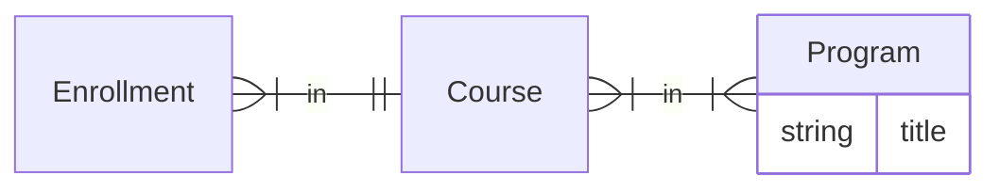

# Write Performant APIs

## General Guidelines
### Avoid excessively complex/nested APIs

- As a rule of thumb, an API shouldn't be returning an object structure deeper than 2 levels.
- If you find yourself needing more depth, it's more likely that consumers of the API may need to make subsequent API calls to another API.

#### Example

You want to avoid patterns like this:

`GET /api/enrollments/`
```json
[{
    "id": 1,
    "course": {
        "id": 234,
        "topics": [{
            "name": "Chemistry"
        }]
    }
}, {
    "id":2,
    "course": {
        "id": 62,
        "topics": [{
            "name": "Physics"
        }]
    }
}]
```

The problems with this approach are:
- More deeply nested responses are increasingly difficult to write optimized queries for.
- Data is duplicated in-memory on the clients, resulting in a larger runtime footprint and worse performance.

Instead, you want to normalize the APIs and split into two API calls:
`GET /api/enrollments`
```json
[{
    "id": 1,
    "course_id": 234
}, ...]
```
`GET /api/courses/?id=234,62`
```json
[{
    "id": 62,
    "topics": [{
        "name": "Physics"
    }]
}, {
    "id": 234,
    "topics": [{
        "name": "Chemistry"
    }]

}]
```

Yes, this is an extra network request for the client, but it has the added benefits of:
- Initial request will be much faster because it's loading less data.
- Results from `/api/courses/?id=234,62` can be more easily cached and may in fact already be loaded and not need to be requested.

### Avoid N+1 queries
Projects are set up with N+1 checks on tests. To ensure these checks can detect problems, make sure you test APIs with data of enough ordinality.

For example, if you're testing a list API, create 5-10 records at each level of the response. Taking our example above for `/api/courses/?id=234,62`, this would mean create several courses and then several topics per course. If you use a lower count, the quantity may not exceed the N+1 checker's detection thresholds.


### Prefetching

There are several ways to prefetch data:

- `select_related(...)` - this is only useful for foreign key relationships
- `prefetch_related(...)` - useful for one-to-many or many-to-many relationships
- `prefetch(...)` - this is useful for nested relationships where the model does not have a direct relationship to the object being looked up


#### Balancing `select_related(...)` vs `prefetch_related(...)`

It is possible to overuse `select_related()` to the point you're actually harming the performance. Too much data and too many joins will slow down the main query. It's best to profile the difference in performance but if you're in doubt it's generally safer to just use `prefetch_related()` since that splits it into a separate query.

#### Using `prefetch()`

This method is an extension of Django's prefetching capabilities provided by the [`django-prefetch`](https://pypi.org/project/django-prefetch/) library.

A prefetcher is good to reach for when you need to fetch data that the base model does not directly depend on. For example with this kind of data model:



If you are building an API for enrollments and want to return the titles of programs the enrollment is in, you can return that without having to return the entire tree by using a prefetcher:


```python
from django.contrib.postgres.aggregates import ArrayAgg
from prefetch import Prefetcher, PrefetchManagerMixin, PrefetchQuerySet

class ProgramTitlesPrefetcher(Prefetcher):
    collect = True  # this will group enrollments by the return value of mapper()

    def mapper(self, enrollment):
        return enrollment.course_id

    def filter(self, ids):
        # important to explicitly return an empty query if there are no ids
        # otherwise you risk weird edge cases where you return the entire table
        if not ids:
            return Program.objects.none()
        # one query to fetch everything
        return Program.objects.filter(
            course__id__in=ids
        ).aggregate(
            # postgres-specific aggregation
            course_ids=ArrayAgg("course__id")
        ).only("title") # only the fields we will use

    def reverse_mapper(self, program):
        return program.course_ids # map the program back to the course ids that are in it

    def decorator(self, enrollment, programs=None):
        # be sure to handle the None case somehow by providing a default value
        # at this point, programs is either None (nothing matched) or the list of Programs
        # for the enrollment where the return value of mapper() was in the 
        # return value(s) from reverse_mapper()
        enrollment.program_titles = [program.title for program in programs] if programs else []

# NOTE: this is named mixin, but it's actually a subclass of models.Manager
class EnrollmentManager(PrefetchManagerMixin):
    prefetch_definitions = {
        "program_titles": ProgramTitlesPrefetcher
    }

class Enrollment(models.Model):

    objects = EnrollmentManager()


# Now you can do this and it will only perform 2 queries
Enrollment.objects.prefetch("program_titles")

```

If you have a custom `QuerySet`, you need to do a little bit of extra configuration because `PrefetchManagerMixin` is hardcoded to return `PrefetchQuerySet` from `get_queryset_class`:

```python


class EnrollmentQuerySet(QuerySet, PrefetchQuerySet): ...

class EnrollmentManager(PrefetchManagerMixin):

    ...

    def get_queryset_class(self):
        return EnrollmentQuerySet
```


### Enforce Prefetching

You should have your serializers subclass `mitol.common.serializers.BaseSerializer` and then define `required_prefetches`. If you do not define `required_prefetches`, a `RequiredPrefetchesNotDefinedError` error will be raised on serializer init:

```python
from mitol.common.serializers import BaseSerializer

class EnrollmentSerializer(BaseSerializer):
    required_prefetches: list[str] = [
        "program_titles"
    ]
```

This will ensure that the serializer can't be used without that prefetch having been done or it will raise a `RequiredPrefetchMissingError` naming the prefetch that wasn't requested. A "prefetch" in this situation is anything that should be `prefetch()`, `prefetch_related()`, or `select_related()`.

You can opt out of this for tests and async code such as celery tasks by passing `{"skip_prefetch_checks": THIS_IS_NOT_AN_API}`. As the name (and you) attests to, this should not be used _anywhere_ near an API including when other serializers call it. DRF will propagate the context into child serializers as well.
